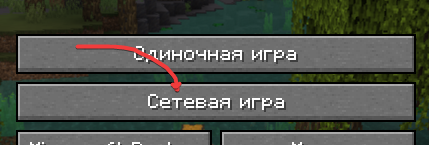
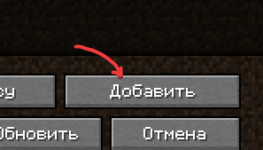
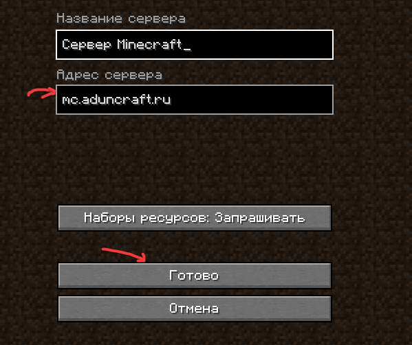

# Как начать игру?

Прежде чем играть на нашем сервере мы рекомендуем установить дополнительные моды.

## Установка модов

1. Установите любой лаунчер
2. [Скачайте архив с гугл.диска](https://drive.google.com/file/d/15fcjWcmyJctdEhaKfCOGuxxDkw3BgXyk/view?usp=sharing)
3. Перейдите в .minecraft (ваше местоположение игры) и перекиньте всё с архива туда.
4. Зайдите в лаунчер и установите `Fabric 1.19.4`
5. `ПРОФИТ`

## Как добавить сервер

Берём айпишник: `mc.aduncraft.ru` и добавляем в список серверов

<figure><figcaption></figcaption></figure>

 

<figure><figcaption></figcaption></figure>

 

<figure><figcaption></figcaption></figure>

