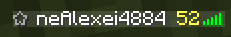

# Значки

Значки перед ником были добавлены как замена префиксам и они делятся по группам.

<figure><figcaption>
ADUN + VIP
</figcaption></figure>

 

<figure><figcaption>
МЕДИА + ПРОВЕРЕННЫЙ
</figcaption></figure>

## Системные

<table data-view="cards"><thead><tr><th></th><th></th></tr></thead><tbody><tr><td></td><td>ADUN (участник ADUN конторы, сквада стримеров, в честь которых и создан сервер)</td></tr><tr><td></td><td>Модератор - следит за порядком</td></tr><tr><td></td><td>Медиа - типа стример сервера, но не адун</td></tr></tbody></table>

## Ролевые

<table data-view="cards"><thead><tr><th></th><th></th></tr></thead><tbody><tr><td></td><td>VIP (самый активный игрок)</td></tr><tr><td></td><td>Проверенный игрок (проверенный игрок временем, есть возможность взаимодействовать на спавн)</td></tr></tbody></table>

Значки не дают никаких преимуществ над другими игроками и являются только показателем информации.
